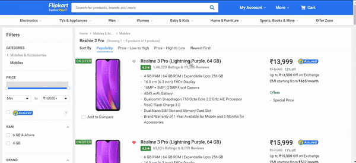

# Impact Hackathon 2019 - Team Appendly

## Theme: Finance by BlackRock

### Team Members
* [Sai Adarsh S](https://LINkedin.com/in/sai-adarsh/), [Rajasekar M](https://www.linkedin.com/in/rajasekar1999), [Sibi Bose P S ](https://www.linkedin.com/in/sibi-bose-8683b6150/)

### Targeted Problem Statement
* The lack of a feature in Expenditure Tracking Apps to
cognitively suggest better purchasing patterns to the
customer based on their e-commerce activity.
* The lack of a feature in the E-Commerce Websites to
suggest the information regarding the value for
money aspects of the product such as the monthly
**cost per minimum lifetime** of the sought product,
brand reputation, etc.

### Our Solution
* **Prototype** : A Web Application, when pasted the e-commerce link of the
corresponding product, would fetch details like Cost of the Product,
Warranty of the Product, Rating of the Product, Monthly Cost per
Lifetime, Value for Money Aspects of the Product and stores it cloud for
later retrieval.
* **Approaching Final Solution**: Browser plugins for major browsers that
does all these automatically combined with Web/Mobile App that tracks
all financial activities of the customer thereby automatically suggesting
better purchasing choices based on a score generated by considering
monthly cost per minimum lifetime and value for money aspects of the
product looked for by the customer in e-commerce websites

### Business Plan
Revenue can be generated out of this model by:
* Having Subscription Plans for the Plugin/Mobile
App/Web App at different levels of Pricing with varied
range of usability, storage, features and support
system.
* Suggesting “Value for Money” Products as ads for the
customers and generating revenue by ads.

### Stacks Used:

### Rakuten API used:
* [Fixer Currency API](https://english.api.rakuten.net/fixer/api/fixer-currency) for Currency Conversion
* [Web Search API](https://english.api.rakuten.net/contextualwebsearch/api/web-search) for Image Search

### Project Links:
* Github Repo Link : https://github.com/sai-adarsh/impacthackathon
* Demo YouTube Link : https://youtu.be/bsqCphK4wYQ
* Heroku App Link : http://impacthackathon.herokuapp.com/
* **Product Hunt Link**
https://www.producthunt.com/posts/flipkart-cost-per-lifetime-predictor

## Installation
* Clone the repo

		git clone https://github.com/sai-adarsh/impacthackathon.git
		cd impacthackathon
		
* Install the required plugins
		
		pip install -r requirement.txt
		
## Running Locally:
* To run the WebApp locally: 

		python app.py
  
## Demo

